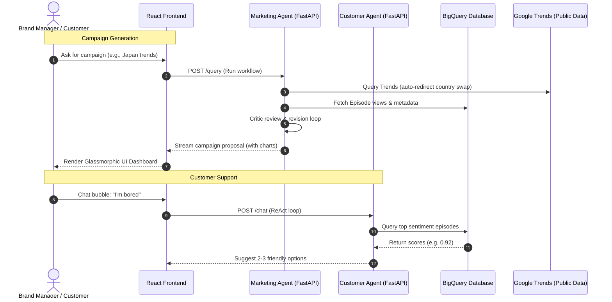

# 🌌 ACME Multi-Agent Workspace

A production-grade, modular multi-agent ecosystem engineered for **ACME Media**. This system orchestrates automated marketing campaign design and interactive customer support workflows using Vertex AI and the Gemini model suite.

---

## 🗺️ System Interaction Diagram

---

## 📦 Monorepo Component Overview

| Component | Stack | Primary Responsibilities | Core Logic |
| :--- | :--- | :--- | :--- |
| **[Marketing Agent](file:///usr/local/google/home/owq/Desktop/Agents%20for%20ACME/marketing-agent/README.md)** | `Python`, `FastAPI`, `ADK 2.0` | Workflow orchestration, BQ integration, geographic trend swapping | `agent.py` |
| **[Customer Agent](file:///usr/local/google/home/owq/Desktop/Agents%20for%20ACME/customer-agent/README.md)** | `Python`, `FastAPI`, `ADK ReAct` | Answering queries, sentiment-driven recommendations, rate-limiting | `agent.py` |
| **[Frontend Dashboard](file:///usr/local/google/home/owq/Desktop/Agents%20for%20ACME/frontend/README.md)** | `React`, `Vite`, `Vega-Lite` | Interactive metrics rendering, step-by-step progress tracking, support chat widget | `App.jsx` |

---

## ⚡ Key Highlights & Defensibility

> [!NOTE]
> ### 🛡️ Multi-Region Resiliency Fallback
> The system implements a robust, thread-safe fallback chain that rotates requests across regional endpoints (`us-east4`, `us-west1`, `europe-west4`) with exponential backoff on HTTP `429 RESOURCE_EXHAUSTED` responses.

> [!TIP]
> ### 📊 Smart Trends Query Routing
> Google Trends queries are dynamically routed. If a query matches a known country (e.g., `"Japan"`), the query is swapped into a regional filter to pull top trending topics rather than searching for the string "Japan" literally, eliminating search-term bias.

---

## 🚀 Getting Started

Ready to deploy or run locally? Read the detailed, step-by-step instructions in the:
👉 **[Deployment & Usage Guide](file:///usr/local/google/home/owq/Desktop/Agents%20for%20ACME/DEPLOYMENT_GUIDE.md)**
